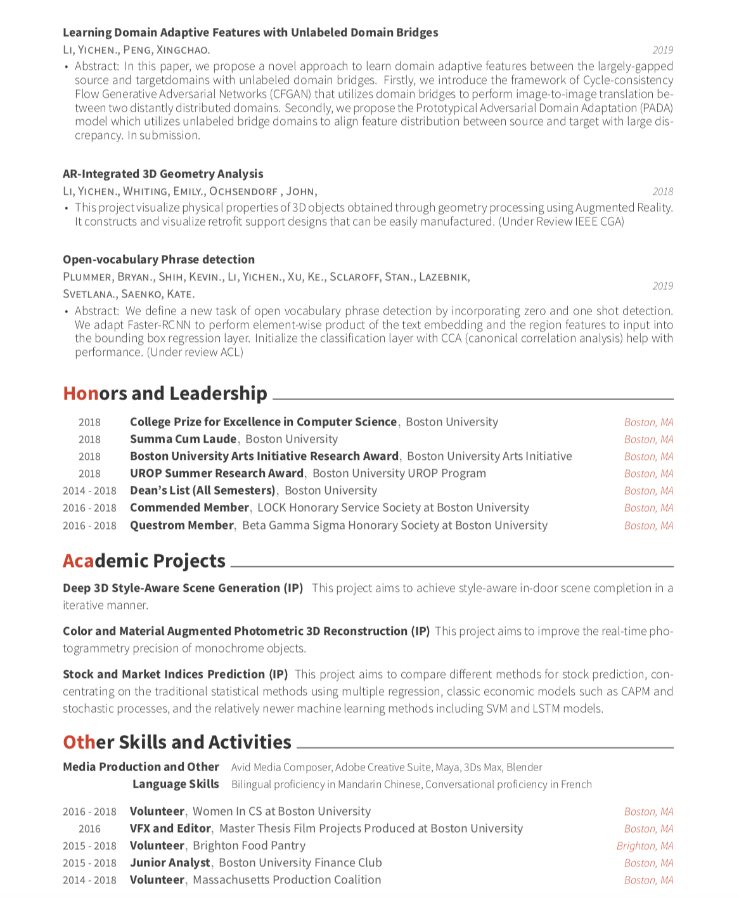
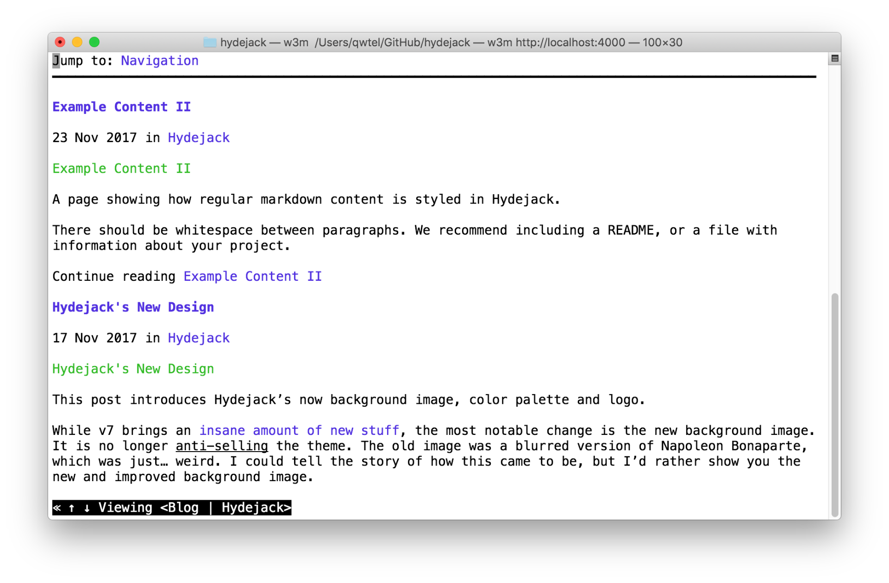
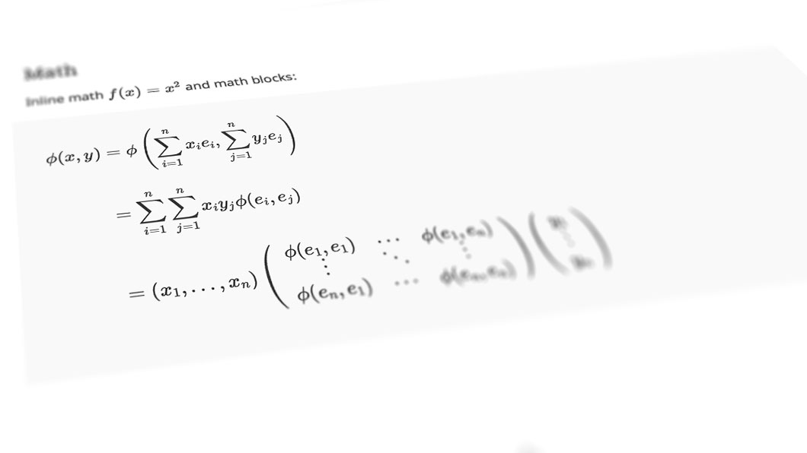

# CV

<!-- ## A Free Blogging Theme -->
<!-- **Hydejack** started out as a free blogging theme for Jekyll — and continues to be so. -->

<!--posts-->


<!-- ## An Impressive Portfolio -->
<!-- A portfolio that's guaranteed to be impressive — no matter what you put into it. -->

<!--projects-->


<!-- ## A Printable Resume -->
<!-- Get a resume that's consistent across the board — whether it's on the web, mobile, print, or [PDF](assets/Resume.pdf). -->

{: data-width="1867" data-height="1389"}
Front and center page of a print resume generated by Hydejack.
{:.figure}

{:data-width="1920" data-height="2340"}
{:.figure}


{:data-width="1920" data-height="2340"}
{:.figure}


<!-- ## Just Markup -->
<!-- **Hydejack** boasts a plethora of modern JavaScript, but make no mistake: It's still a plain old *web page* at its core. It works without JavaScript, and you can even view it in a text-based browser like `w3m`: -->

<!-- {:data-width="1920" data-height="1260"} -->
<!-- The Hydejack blog, as seen by the text browser `w3m`. -->
<!-- {:.figure} -->


<!-- ## Syntax Highlighting -->
<!-- **Hydejack** features syntax highlighting, powered by [Rouge]. -->

<!-- ```js
document.getElementsByTagName("hy-push-state")[0].addEventListener("hy-push-state-load", function() {
  // <your init code>
});
``` -->


<!-- ## Beautiful Math -->
<!-- They say math is beautiful — and with **Hydejack**'s [math support][latex] it's also guaranteed to *look* beautiful. -->

<!-- {:data-width="1060" data-height="596"} -->
<!-- Hydejack uses KaTeX to efficiently render math. -->
<!-- {:.figure} -->


