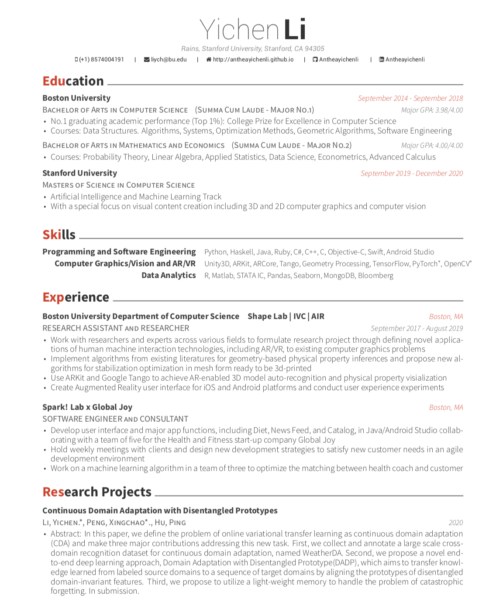

# [CV](asset/Resume.pdf)

## Education

#### Boston University 
> BACHELOR OF ARTS IN COMPUTER SCIENCE (SUMMA CUM LAUDE)                   Major GPA: 3.98/4.00
* No.1 graduating academic performance (Top 1%): College Prize for Excellence in Computer Science
* Courses: Data Structures. Algorithms, Systems, Optimization Methods, Geometric Algorithms, Software Engineering
BACHELOR OF ARTS IN MATHEMATICS AND ECONOMICS (SUMMA CUM LAUDE)          Major GPA: 4.00/4.00
* Courses: Probability Theory, Linear Algebra, Applied Statistics, Data Science, Econometrics, Advanced Calculus

#### Stanford University                                          
> MASTERS OF SCIENCE IN COMPUTER SCIENCE
* Artificial Intelligence and Machine Learning Track
* With a special focus on visual content creation including 3D and 2D computer graphics and computer vision

*Expected Graduation: June 2021*

## Research and Publication
- Online Variational Domain Adaptation (CDA) 
**Li, Yichen.***, Peng, Xingchao.*, Hu, Ping.
> In this paper, we define the problem of online variational transfer learning as continuous domain adaptation (CDA) and make three major contributions addressing this new task. First, we collect and annotate a large scale cross-domain recognition dataset for continuous domain adaptation, named WeatherDA. Second, we propose a novel end-to-end deep learning approach, Domain Adaptation with Disentangled Prototype(DADP), which aims to transfer knowledge learned from labeled source domains to a sequence of target domains by aligning the prototypes of disentangled domain-invariant features. Third, we propose to utilize a light-weight memory to handle the problem of catastrophic forgetting. In submission.

- Prototypical Adversarial Domain Adaptation (PADA)
**Li, Yichen.**, Peng, Xingchao. 
> In this paper, we propose a novel approach to learn domain adaptive features between the largely-gapped source and targetdomains with unlabeled domain bridges. Firstly, we introduce the framework of Cycle-consistency Flow Generative Adversarial Networks (CFGAN) that utilizes domain bridges to perform image-to-image translation between two distantly distributed domains. Secondly, we propose the Prototypical Adversarial Domain Adaptation (PADA) model which utilizes unlabeled bridge domains to align feature distribution between source and target with large discrepancy. In submission.

- Open Vocabulary Phrase Detection 
Bryan A. Plummer, Kevin J. Shih, **Yichen Li**, Ke Xu, Svetlana Lazebnik, Stan Sclaroff, Kate Saenko
> We define a new task of open vocabulary phrase detection by incorporating zero and one shot detection. We adapt Faster-RCNN to perform element-wise product of the text embedding and the region features to input into the bounding box regression layer. Initialize the classification layer with CCA (canonical correlation analysis) help with performance. (in submission to ACL)

- Augmented Reality and Geometry-Based Physical Stability Properties
**Li, Yichen**, Henneman, Dennis., Ochsendorf, John., Whiting, Emily.
> In this paper, we present a novel approach by using simple additive manufacturing techniques for model stabilization to help with sculpture conservation. We also integrate Augmented Reality (AR) technology to enable more intuitive user-interaction and visualization, and our platform can be installed on any AR-enabled device, which would allow professionals to work with sculptures. Our platform con- structs mesh of different types of support structures in real-time subjected to user-specified preferences ready to be 3D printed and attached to the object of interest for added stability. We demonstrate that the 3D-printed support structure generated by our model provides the sufficient stability but is a lot faster, cheaper, and more convenient than the state-of-the-art system. 

## Skills
	- **Programming and Software Engineering**	Python, Haskell, Java, Ruby, C\#, C++, C, Objective-C, Swift, Android Studio
   	- **Computer Graphics/Vision and AR/VR**	Unity3D, ARKit, ARCore, Tango, Geometry Processing, PyTorch, Tensorflow
   	- **Data Analytics**	{ R, Matlab, STATA IC, Pandas, Seaborn, MongoDB, Bloomberg}

{: data-width="1867" data-height="1389"}
{:.figure}

