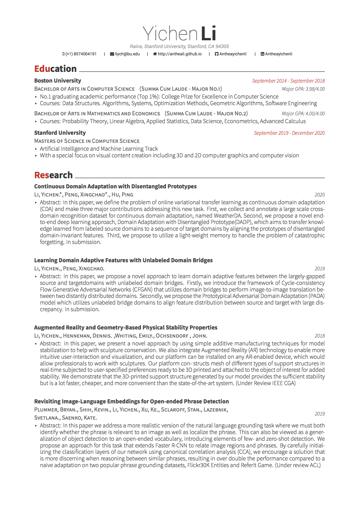
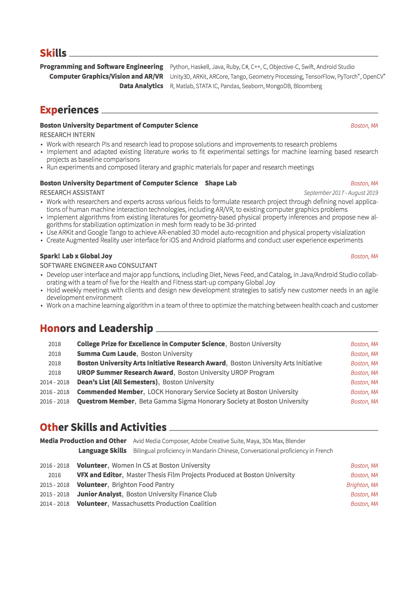

# [CV](asset/Resume.pdf)

{: data-width="1240" data-height="1753"}
{:.figure}

{: data-width="1240" data-height="1753"}
{:.figure}

## Education

#### Boston University 
> BACHELOR OF ARTS IN COMPUTER SCIENCE (SUMMA CUM LAUDE)                   Major GPA: 3.98/4.00
* No.1 graduating academic performance (Top 1%): College Prize for Excellence in Computer Science
* Courses: Data Structures. Algorithms, Systems, Optimization Methods, Geometric Algorithms, Software Engineering
BACHELOR OF ARTS IN MATHEMATICS AND ECONOMICS (SUMMA CUM LAUDE)          Major GPA: 4.00/4.00
* Courses: Probability Theory, Linear Algebra, Applied Statistics, Data Science, Econometrics, Advanced Calculus

#### Stanford University                                          
> MASTERS OF SCIENCE IN COMPUTER SCIENCE
* Artificial Intelligence and Machine Learning Track
* With a special focus on visual content creation including 3D and 2D computer graphics and computer vision

*Expected Graduation: June 2021*

## Skills
* **Programming and Software Engineering**	
> Python, Haskell, Java, Ruby, C\#, C++, C, Objective-C, Swift, Android Studio
* **Computer Graphics/Vision and AR/VR**	
> Unity3D, ARKit, ARCore, Tango, Geometry Processing, PyTorch, Tensorflow
* **Data Analytics**	
> R, Matlab, STATA IC, Pandas, Seaborn, MongoDB, Bloomberg

